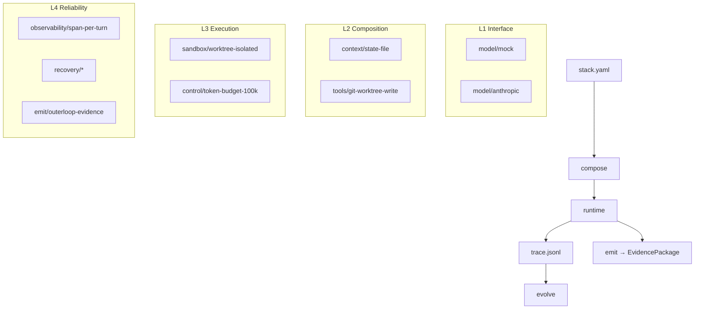

# Architecture



## Packages

| Package | Layer | Role |
|---------|-------|------|
| `interface` | L1 | Model providers |
| `compose` | L2 | Stack builder, catalogue |
| `mcp` | L2 | Tool dispatch stub |
| `runtime` | L3 | Session + turn loop |
| `trace` | L4 | Event recorder |
| `evolve` | L4 | L1 reports, L2 proposals |
| `emit` | L4 | outerloop evidence seam |
| `cli` | — | `foundry` commands |

## Ecosystem

```
loop-engineering  →  harness-foundry  →  outerloop
   (patterns)         (runtime)          (governance)
```

See [vs-alternatives.md](./vs-alternatives.md) for positioning against raw agent SDKs.